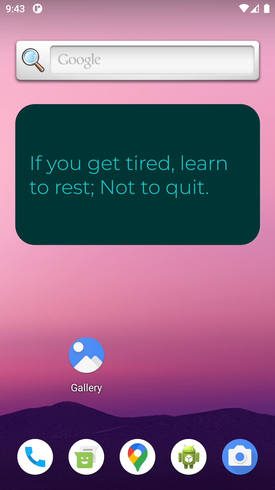
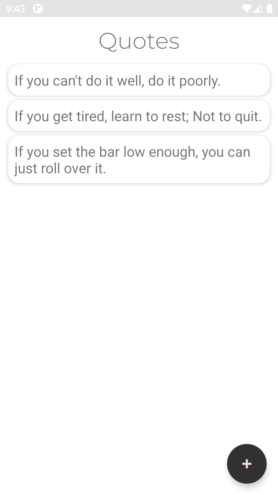
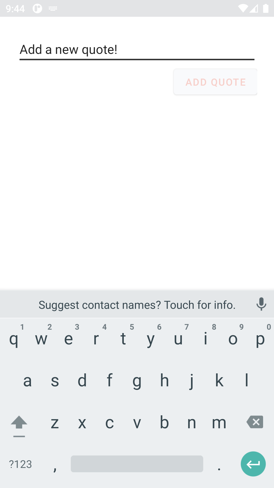
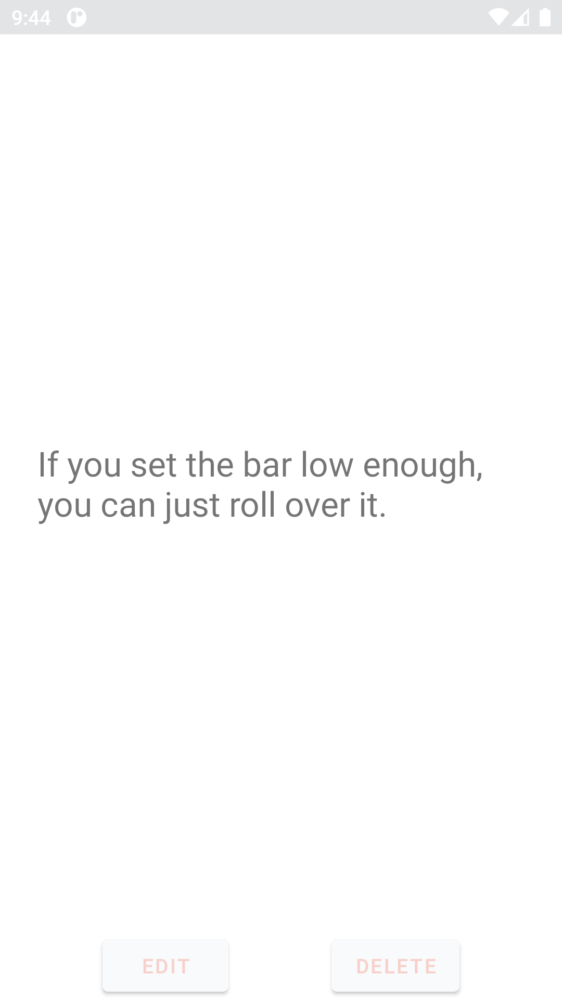

# Quote Tumbler

## Installation
To install Quote Tumbler, visit the [Google Play Store page](https://play.google.com/store/apps/details?id=com.rgilyard.quotetumbler&pli=1) and download the app.

## Usage
Quote Tumbler is easy to use:
- Simply press the \+ button to add a quote.
- Select a quote to edit or delete it.
- Place the widget on your home screen to see a new random quote every 30 minutes.

## Screenshots

 

## About the Developer
I created this app for my personal use and enjoyment. As a busy individual, I may update the app or add new features when I find the time. I hope you enjoy using Quote Tumbler as much as I do!
Feel free to experiment with the app, customize it to your liking, and share it with friends and family. If you have any questions, suggestions, or feedback, please don't hesitate to reach out.